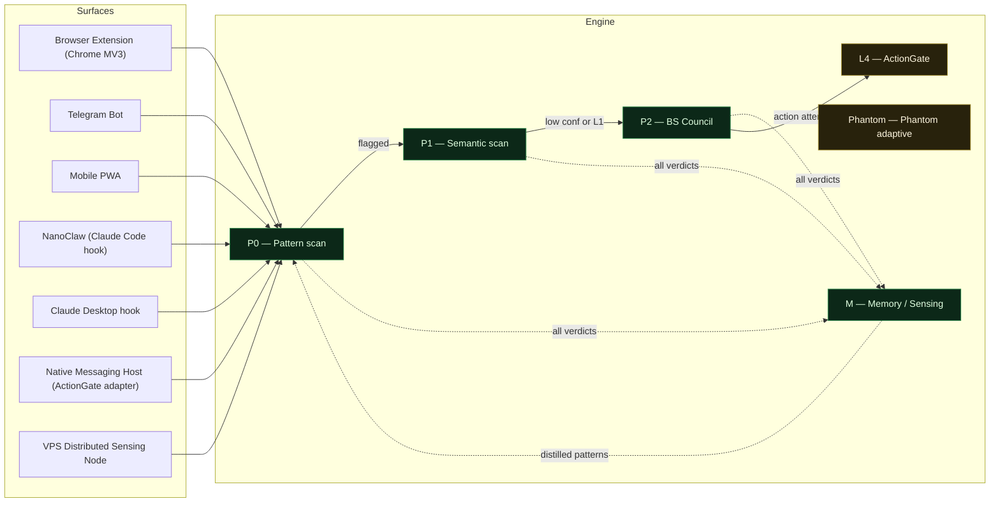

# RAI Architecture — Live View

> **Auto-generated. Do not edit.**
> Source of truth: `architecture.json` · Regenerate: `npm run regen-arch`
> Generated: 2026-07-20 07:17 UTC · Commit: `d376202` (`main`) · ⚠ working tree dirty
> Schema version: 1.0 · Last manual edit to source: 2026-05-19

---

## Diagram

---

## Engine modules

| ID | Name | Status | Package | OLs | What |
|---|---|---|---|---|---|
| P0 | Pattern scan | ✓ shipped | `@rai/core` | — | Local regex scanner. Zero-cost, runs on every surface. Detects known signatures across L-2/L-1/L0. |
| P1 | Semantic scan | ✓ shipped | `@rai/core` | OL-124 | Claude API scanner. Default Haiku, escalates to Sonnet when confidence < 0.65. Covers L-2/L-1/L0/L1. |
| P2 | BS Council | ✓ engine shipped | `@rai/p2-agent` | OL-281 | 4-agent verifiability layer. Heterogeneous providers (Anthropic + Together + Ollama) across 3 diversity axes. Verdicts: CONFIRMED / CONTESTED / UNVERIFIED / FALSE-ALARM. Covers L1/L2/L3. |
| L4 | ActionGate | ◐ in-flight | `@rai/core` | OL-140, OL-245 | Agent action firewall. Lineage tracking + OAuth scope attestation. MCP adapter + shell adapter + native-messaging-host adapter all implemented. Phantom adaptive layer next to it. |
| Phantom | Phantom adaptive | ◐ in-flight | `@rai/core` | — | Adaptive threat layer next to L4 — learns per-agent action patterns to flag unfamiliar side-effects. Companion to ActionGate. |
| M | Memory / Sensing | ✓ engine shipped | `@rai/core` | OL-239, OL-241 | Distributed sensing + threat-signature store. Phase 1 shipped: local-only PrivateLayer + cross-surface ingest endpoint + dream-phase offline distillation, 45 tests passing. Phase 2 (community pool with differential privacy) pending. |

### Files per module

**P0 — Pattern scan** (`@rai/core`)
  - `packages/core/rai-scan-p0.ts`

**P1 — Semantic scan** (`@rai/core`)
  - `packages/core/rai-scan-p1.ts`

**P2 — BS Council** (`@rai/p2-agent`)
  - `packages/p2-agent/src/bs-council.ts`
  - `packages/p2-agent/src/bs-council-runner.ts`
  - `packages/p2-agent/config/p2-council.json`

**L4 — ActionGate** (`@rai/core`)
  - `packages/core/action-gate.ts`
  - `packages/core/action-gate-mcp.ts`
  - `packages/core/action-gate-shell.ts`
  - `packages/core/action-gate-native-messaging-host.ts`
  - `packages/core/action-gate-native-messaging-host-runner.ts`
  - `packages/core/audit-log.ts`
  - `packages/core/policy-loader.ts`
  - `docs/28-rai-actiongate-spec.md`

**Phantom — Phantom adaptive** (`@rai/core`)
  - `packages/core/phantom.ts`
  - `packages/core/phantom.test.ts`

**M — Memory / Sensing** (`@rai/core`)
  - `packages/core/scan-log.ts`
  - `packages/core/private-layer.ts`
  - `packages/core/threat-signature.ts`
  - `packages/core/dream-phase.ts`
  - `packages/core/ingest-server.ts`

---

## Surfaces

| ID | Surface | Status | Package | OLs | What |
|---|---|---|---|---|---|
| ext-chrome | Browser Extension (Chrome MV3) | ✓ shipped | `rai-extension` | — | Right-click scan + ambient DOM scan on AI sites. |
| telegram | Telegram Bot | ✓ shipped | `@rai/telegram-bot` | — | Forward-to-scan multi-tenant consumer beachhead. |
| pwa | Mobile PWA | ✓ shipped | `rai-mobile-pwa` | — | Manual scan + share-target on iOS/Android. |
| nanoclaw | NanoClaw (Claude Code hook) | ✓ shipped | `(external)` | — | PreToolUse hook. Tim's own dev environment. |
| claude-desktop | Claude Desktop hook | ◐ in-flight | `(external)` | OL-235 | DOM scan on claude.ai chats. |
| ng-host | Native Messaging Host (ActionGate adapter) | ○ spec | `(spec)` | OL-140 | L4 gate bridge — VCCE for Chrome → local policy engine. |
| vps-relay | VPS Distributed Sensing Node | ◐ built (test pending) | `(infra)` | OL-241 | Ingest endpoint for cross-surface scan events. Smoke test pending. |

---

## Threat-layer × engine-module coverage

| Threat Layer | Label | P0 | P1 | P2 | L4 | Phantom | M |
|---|---|---|---|---|---|---|---|
| L-2 | Infrastructure / supply chain | ● | ● | · | · | · | · |
| L-1 | Model poisoning / drift | ● | ● | · | · | · | · |
| L0 | Prompt injection | ● | ● | · | · | · | · |
| L1 | Misinformation | · | ● | ● | · | · | · |
| L2 | Cascade risk | · | · | ● | · | · | · |
| L3 | Systemic harm | · | · | ● | · | · | · |
| L4 | Agent action / side-effect | · | · | · | ● | ● | · |

`●` = covered, `·` = not covered

---

## Tier gating

| Tier | P0 | P1 | P2 | L4 |
|---|---|---|---|---|
| free | ✓ | — | — | — |
| pro | ✓ | ✓ | partial (BYOK + local fallback) | — |
| premium | ✓ | ✓ | ✓ | planned |

---

## Data flow

1. Surface (extension / pwa / telegram / nanoclaw) emits scan event
2. P0 runs locally on every surface (zero-cost regex)
3. If P0 flags → P1 (Haiku, BYOK) for semantic verdict
4. If P1 confidence low OR L1 misinfo → P2 BS Council (4-agent heterogeneous council)
5. All verdicts written to ScanLog → ingest-server → Memory/Sensing layer
6. Dream Phase (offline) distills patterns → ThreatSignature store → seeds next P0 patterns
7. L4 ActionGate (spec) intercepts agent actions pre-execution

---

## Deck

- Latest version: **v15** — [`assets/deck & web design/Drafts/rai-teaser-deck-v15.html`](../assets/deck%20&%20web%20design/Drafts/rai-teaser-deck-v15.html)
- Appendix A1: BS Council architecture (added 2026-05-19)

---

_To update the architecture model, edit `architecture.json` at the repo root and run `npm run regen-arch`. A launchd plist regenerates this file Mon/Wed/Fri at 09:00 local._
